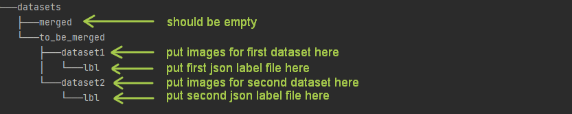
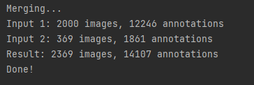

# COCO-merge

The coco_merge script performs the merging of several datasets with markup in the COCO format. To get more information
follow the [link](https://cocodataset.org/).

After executing the script in the specified location `-mp` the `lbl` folder will be created in which the json file with
the markup will be located. Also, all images with changed names will be transferred to the specified location.

## How to launch coco_merge

First of all you should prepare data according to the following structure:

For one dataset there should be only one file with markup (many images - one file with markup).

So an example command to run would be like this:

`python3 coco_merge.py -tbmp datasets/to_be_merged -mp datasets/merged`

Example of successful script output:

## Script parameters

To run the coco_merge script, you must pass the following parameters.

### Required parameters

`tbmp` - the path to the location with the original datasets. It is important that the label file with the markup is
named as `COCO_annotation.json`.
`mp` - the path to save the results. This folder must be empty.

### Optional parameters, default is empty

`d` - a description of the project to be added to the info dictionary.
`v` - the version of the dataset to be added to the info dictionary.
`y` - the year of the dataset to be added to the info dictionary.
`c` - the contributor to be added to the info dictionary.
`url` - a link to the dataset that needs to be added to the info and licenses dictionaries.

## Versions

Python 3.10.5

## Sources

1. https://gradiant.github.io/pyodi/reference/apps/coco-merge/